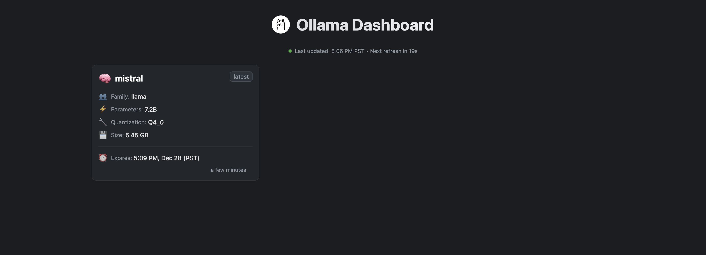

# Ollama Dashboard

A lightweight, personal dashboard for monitoring your locally running Ollama models. Built with Flask and designed for simplicity.



## Purpose

Ollama Dashboard provides a clean, minimal web interface to:

 - View all your running Ollama models in one place
 - Monitor model details like family, parameters, and quantization
 - Track model sizes and expiration times
 - View historical model usage
 - Auto-refresh every 30 seconds to keep information current

## Features

- 🎯 Simple, single-purpose design
- 🔄 Auto-refreshing dashboard
- 🎨 Dark mode interface
- 📱 Responsive layout
- 📋 Model history tracking
- 🕒 Real-time status indicators
- 0️⃣ Zero configuration needed
- 🐳 Docker support

### Dashboard Features

- Real-time model status monitoring
- Detailed model information including:
  - Model family and version
  - Parameter size
  - Quantization level
  - Model size (adaptive units)
  - Expiration time (when applicable)
- Status indicator showing Ollama connection state
- Clear error messages when Ollama is not running

### History Tracking

- Sidebar with historical model usage
- Timestamps for all model runs
- Duration tracking for model sessions
- Preserves model details for reference

## Prerequisites

- Python 3.x (for local installation)
- Docker (for containerized installation)
- Ollama running locally

## Installation Options

### Option 1: Local Installation

1. Clone the repository:

```bash
git clone https://github.com/poiley/ollama-dashboard.git
cd ollama-dashboard
```

2. Install dependencies:

```bash
pip install -r requirements.txt
```

3. Run the dashboard:

```bash
python wsgi.py
```

### Option 2: Docker Installation (Recommended)

1. Clone the repository:

```bash
git clone https://github.com/poiley/ollama-dashboard.git
cd ollama-dashboard
```

2. Build and run using the provided script:

```bash
./scripts/build.sh
```

The dashboard will be available at http://127.0.0.1:5000

## Configuration

The dashboard can be configured using environment variables:

- `OLLAMA_HOST`: Ollama server host (default: localhost)
- `OLLAMA_PORT`: Ollama server port (default: 11434)
- `MAX_HISTORY`: Maximum number of history entries to keep (default: 50)
- `HISTORY_FILE`: Path to history file (default: history.json)

When running with Docker, these are pre-configured in the `docker-compose.yml` file.

## Troubleshooting

### Common Issues

1. **403 Forbidden Error**
   - Ensure Ollama is running on your host machine
   - Check that port 11434 is accessible
   - Verify your firewall settings allow the connection

2. **Connection Errors**
   - When using Docker, the dashboard uses `host.docker.internal` to connect to Ollama
   - Ensure Ollama is running before starting the dashboard
   - Check the Ollama logs for any connection issues

3. **Static Files Not Loading**
   - Clear your browser cache
   - Try accessing the dashboard using 127.0.0.1 instead of localhost

### Testing Routes

The dashboard includes test routes to preview different states:

- `/test/no-models` - Preview empty state
- `/test/error` - Preview error state when Ollama isn't running
- `/test/with-models` - Preview dashboard with sample models

## Note

This is a personal utility tool designed for individual use. It's intentionally kept simple and assumes Ollama is running on the same machine. Perfect for developers who want a quick visual overview of their currently running Ollama models.

## Accessing the Dashboard

The dashboard is available at:
- Web Interface: http://127.0.0.1:5000

Note: Please use the IP address (127.0.0.1) rather than localhost to access the dashboard.
